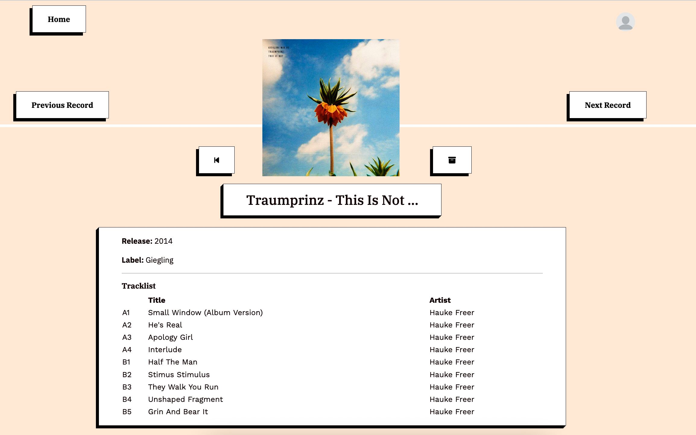
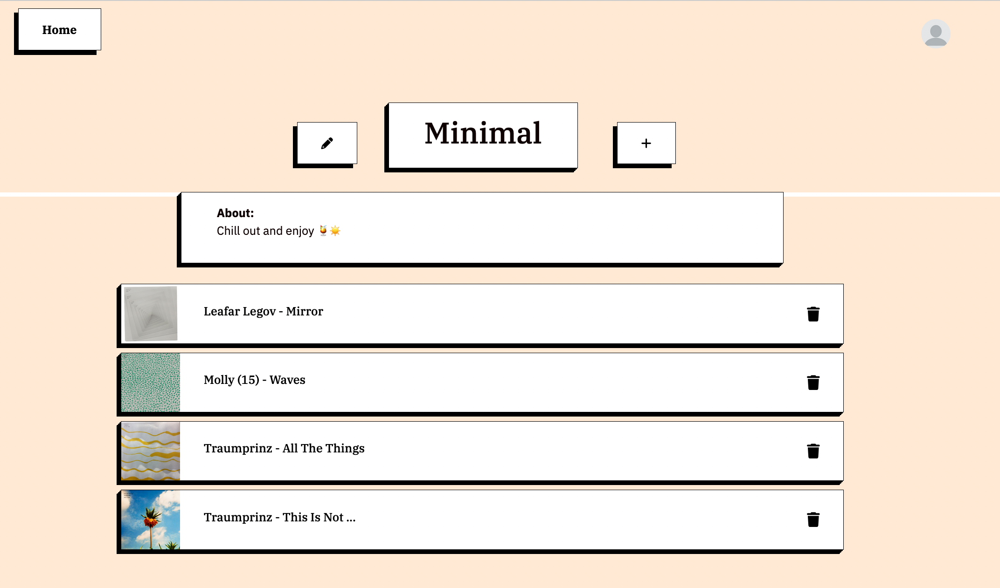
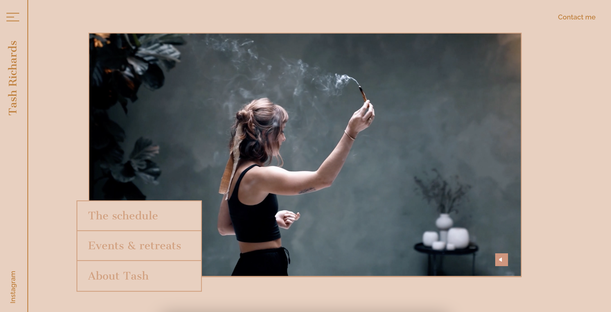
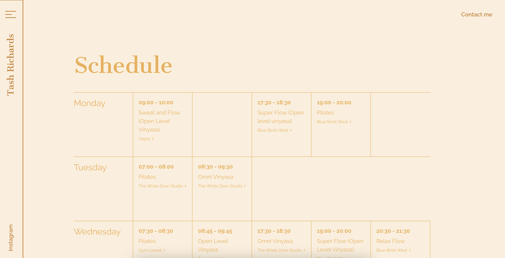
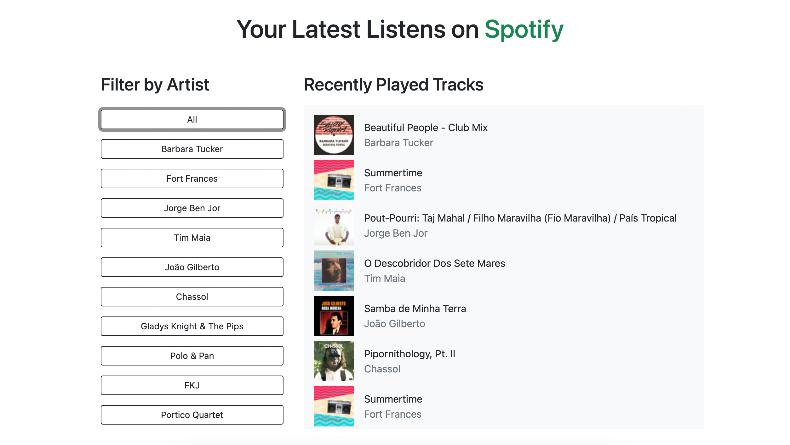
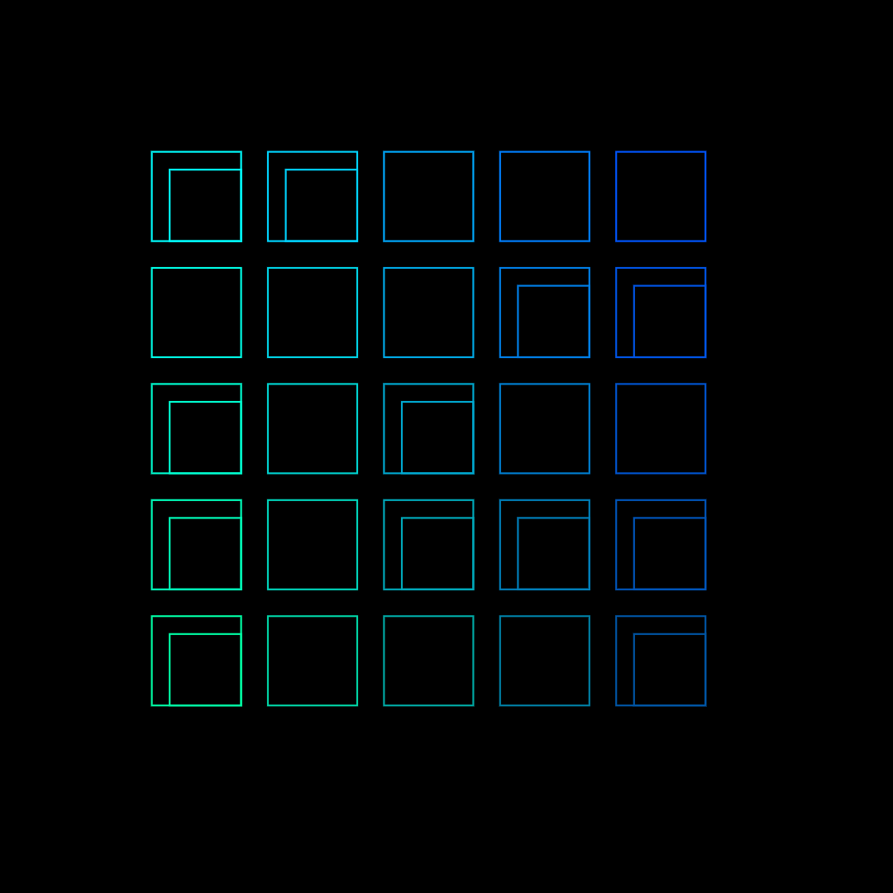
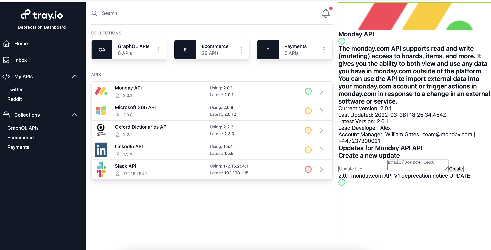
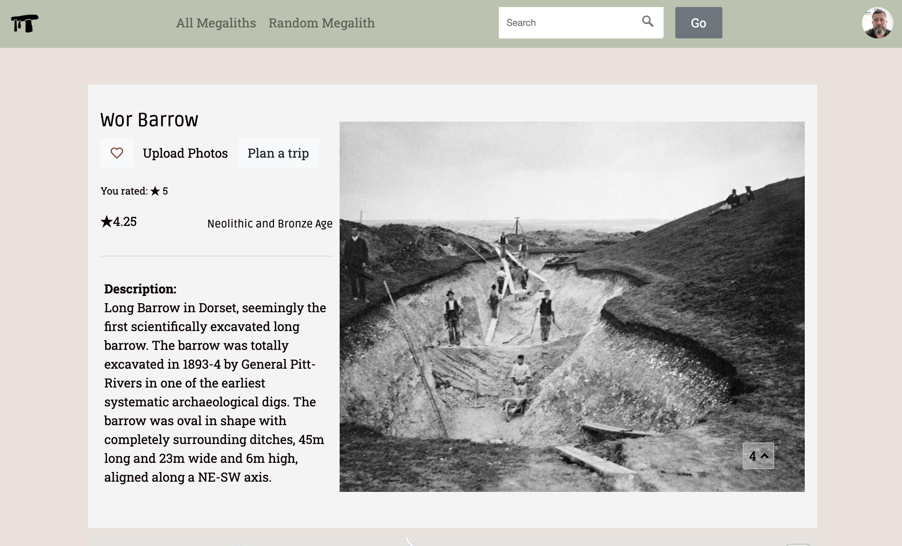

# Portfolio

#### Record Box - https://recordbox-ror.herokuapp.com/
 &nbsp; &nbsp;   &nbsp; 
- a small app built to store your music and keep track of your records seeded with one of my favouite record labels. 
- You can perform all the CRUD actions add your records to your box, and keep track of them. 
- I build this app to trial
    - PG search
    - Devise
    - API with OpenURI and the discogs API
    - Testing
       - System Tests using MiniTest & Capybara
- the app is built using Ruby on Rails, with HTML and CSS front-end
  

 

#### Tash Richards Yoga - https://tashrichards.yoga/

- a small yoga website for my friend a yogi Tash Richards.  
- the app is built using Nuxt.js and CraftCMS using elementAPI as a backend
  

 

#### Spotify Recently Played

- A single page web app to display your recently played tracks on Spotify.  
- The app is built using React.js and the Spotify API with oAuth.
  

#### Creative Coding

- I was reminded how important it is to explore our creative side. Here is a sketch I created after taking Bruno Imbrizi's excellent Creative Coding course on Domestika. 
- Its important to stay positive and playful in your work.
  

#### API Depreciation Backend - https://tray-dashboard-aatd-app.herokuapp.com 
 
* Hackathon task to make a dashboard for a middleware company to track all the APIs they have integrated and any upcoming updates or depreciations.
* I was tasked with Backend Work with @arfacamble on the Rails API backend while @damonspencerroberts lead on react frontend
  

#### Megalithipedia - https://great-stones.herokuapp.com/
 &nbsp; &nbsp;   &nbsp; 
* my team's final project: Find megalithic sites, discuss ancient history, plan walks around stones with chums.
    * featuring: Complex DB schema // Geocoding // AJAX for clean UX // devise for authentication
  

 

